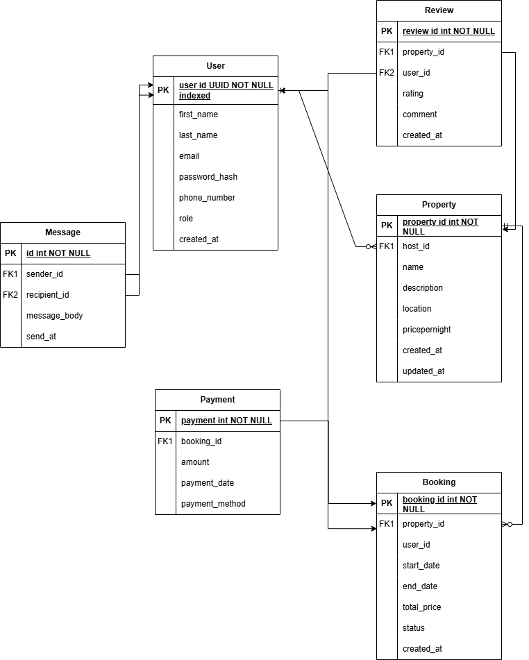

# Requirement Analysis in Software Development
This repository is dedicated to exploring the process of requirement analysis in software development. It provides insights, methodologies, and best practices to ensure that software projects meet user needs and business objectives effectively. Through detailed documentation and examples, this repository aims to serve as a resource for developers, analysts, and project managers.

## What is Requirement Analysis?

Requirement Analysis is a critical phase in the Software Development Lifecycle (SDLC) where the needs and expectations of stakeholders are identified, documented, and analyzed. This process ensures that the software being developed aligns with business objectives and user requirements.

### Importance of Requirement Analysis
1. **Clarity and Understanding**: It helps in gaining a clear understanding of what the stakeholders want, reducing ambiguities and misunderstandings.
2. **Scope Definition**: Proper analysis defines the scope of the project, preventing scope creep and ensuring that the project stays on track.
3. **Risk Mitigation**: Identifying potential risks early in the process allows for proactive measures to address them.
4. **Improved Communication**: It fosters better communication between stakeholders, developers, and project managers, ensuring everyone is aligned.
5. **Cost and Time Efficiency**: By identifying requirements early, it reduces the chances of costly changes and rework during later stages of development.

### Key Activities in Requirement Analysis
- **Requirement Elicitation**: Gathering requirements through interviews, surveys, workshops, and other techniques.
- **Requirement Documentation**: Recording the requirements in a clear and structured format.
- **Requirement Validation**: Ensuring that the documented requirements are accurate, complete, and feasible.
- **Requirement Prioritization**: Determining the importance of each requirement to focus on delivering maximum value.

By conducting thorough Requirement Analysis, teams can lay a strong foundation for successful software development projects.

## Why is Requirement Analysis Important?

Requirement Analysis plays a pivotal role in the Software Development Lifecycle (SDLC) for several reasons:

1. **Foundation for Success**: It establishes a solid foundation for the project by clearly defining what needs to be achieved, ensuring that all stakeholders have a shared understanding of the goals.

2. **Prevention of Errors**: By identifying and addressing potential issues early, it minimizes the risk of errors and misunderstandings that could lead to costly rework or project delays.

3. **Alignment with Business Goals**: It ensures that the software aligns with the strategic objectives of the business, delivering value and meeting user expectations effectively.

By emphasizing these aspects, Requirement Analysis ensures that software projects are well-planned, efficient, and successful.

## Key Activities in Requirement Analysis

- **Requirement Gathering**: Collecting initial requirements from stakeholders, users, and other sources to understand the project's objectives and constraints.

- **Requirement Elicitation**: Using techniques such as interviews, surveys, brainstorming sessions, and workshops to uncover detailed and specific requirements.

- **Requirement Documentation**: Organizing and recording the gathered requirements in a structured format, such as use cases, user stories, or requirement specifications.

- **Requirement Analysis and Modeling**: Analyzing the documented requirements to identify dependencies, conflicts, and feasibility. Creating models like flowcharts, data diagrams, or prototypes to visualize and refine requirements.

- **Requirement Validation**: Ensuring that the requirements are accurate, complete, and aligned with stakeholder expectations through reviews, walkthroughs, or validation sessions.

## Types of Requirements

### Functional Requirements
Functional requirements define the specific behavior or functions of a system. These are the features and capabilities that the system must provide to meet the needs of its users.

**Examples for a Booking Management Project:**
- Users can search for available bookings based on date, location, and preferences.
- The system allows users to create, modify, and cancel bookings.
- Administrators can generate reports on booking statistics.
- Notifications are sent to users for booking confirmations and reminders.

### Non-functional Requirements
Non-functional requirements specify the quality attributes, performance, and constraints of the system. These requirements focus on how the system performs its functions rather than what it does.

**Examples for a Booking Management Project:**
- The system must handle up to 10,000 concurrent users without performance degradation.
- Booking confirmation emails should be sent within 5 seconds of booking completion.
- The system must comply with GDPR regulations for data privacy.
- The user interface should be responsive and load within 2 seconds on all devices.
- The system should have 99.9% uptime availability.

## Use Case Diagrams

Use Case Diagrams are a type of Unified Modeling Language (UML) diagram that visually represent the interactions between users (actors) and a system. They are primarily used during the requirement analysis phase of software development to capture functional requirements and provide a high-level understanding of the system's behavior.

### Benefits of Use Case Diagrams
- **Clarity in Requirements**: They help stakeholders and developers understand the system's functionality and the interactions between users and the system.
- **Improved Communication**: They serve as a common language between technical and non-technical stakeholders.
- **Identification of Actors and Use Cases**: They help in identifying all possible users (actors) and their interactions (use cases) with the system.
- **Foundation for Design**: They provide a foundation for creating detailed design and test cases.

### Use Case Diagram for the Booking System
The following diagram illustrates the use case diagram for the booking system. It identifies the primary actors and their interactions with the system.

To view or edit the diagram, you can use tools like [Draw.io](https://app.diagrams.net/) or similar UML design tools.

## Acceptance Criteria

Acceptance Criteria are a set of predefined conditions that a software product must meet to be accepted by stakeholders. They serve as a benchmark to determine whether a feature or functionality has been implemented correctly and meets the intended requirements.

### Importance of Acceptance Criteria in Requirement Analysis
1. **Clarity and Alignment**: They provide a clear understanding of what is expected from a feature, ensuring alignment between stakeholders and the development team.
2. **Scope Definition**: They help define the boundaries of a feature, preventing scope creep and ensuring focused development.
3. **Quality Assurance**: They act as a reference for testing, ensuring that the feature meets the required standards and functions as intended.
4. **Improved Communication**: They facilitate better communication between stakeholders, developers, and testers by providing a shared understanding of the feature's goals.

### Example: Acceptance Criteria for the Checkout Feature
**Feature**: Checkout in the Booking Management System

**Acceptance Criteria**:
1. Users must be able to review their selected bookings, including details such as date, location, and price, before proceeding to payment.
2. The system must calculate the total cost, including applicable taxes and discounts, and display it to the user.
3. Users must be able to select a payment method (e.g., credit card, PayPal) and complete the payment securely.
4. Upon successful payment, the system must generate a booking confirmation and send it to the user's registered email within 5 seconds.
5. If the payment fails, the system must display an error message and allow the user to retry or select a different payment method.

By defining and adhering to Acceptance Criteria, teams can ensure that features are delivered as expected, meeting both user needs and business objectives.